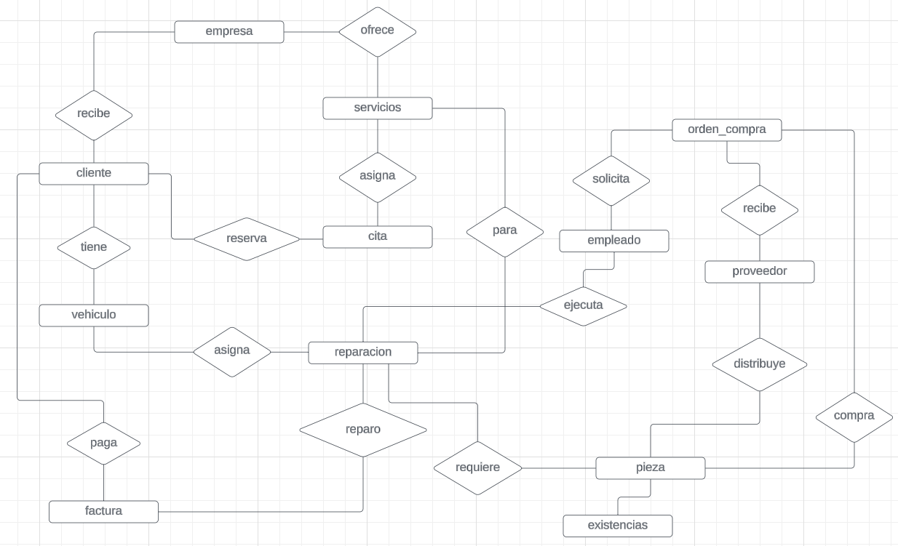
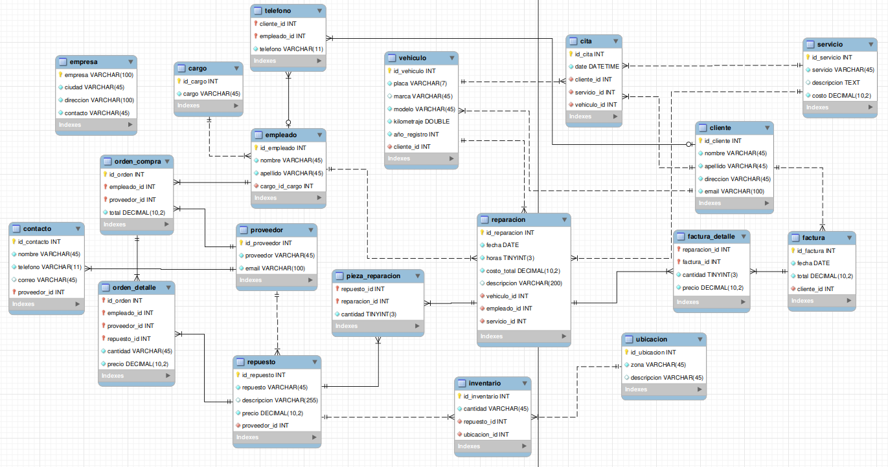

# proyectoDB
El objetivo de este proyecto es desarrollar un sistema de gestión de base de datos avanzada para un taller automotriz, utilizando MySQL, que permita administrar de manera eficiente todos los aspectos operativos del taller. Este sistema centralizará
la información de clientes, vehículos, servicios, reparaciones, empleados, proveedores, citas, inventarios, órdenes de compra y facturación, asegurando la integridad y consistencia de los datos a través de técnicas de normalización.

## Modelo conceptual.

## Modelo relacional.


## Consultas requeridas
1. Obtener el historial de reparaciones de un vehículo específico.
    ```sql
        SELECT *
        from reparacion as RE
        WHERE RE.vehiculo_id = 1;
    ```
    ```
        +---------------+------------+-------+-------------+-----------------------+-------------+-------------+-------------+
        | id_reparacion | fecha      | horas | costo_total | descripcion           | vehiculo_id | empleado_id | servicio_id |
        +---------------+------------+-------+-------------+-----------------------+-------------+-------------+-------------+
        |             1 | 2020-06-01 |     4 |   200000.00 | Reparación del motor  |           1 |           1 |           1 |
        +---------------+------------+-------+-------------+-----------------------+-------------+-------------+-------------+
    ```
    **Explicaciòn:** Recorro la entidad *reparacion* buscando el vehiculo con *id* "1".

1. Calcular el costo total de todas las reparaciones realizadas por un empleado específico en un período de tiempo.
    ```sql
        SELECT RE.empleado_id AS 'empleadoID', SUM(RE.costo_total) AS 'Total en reparaciones'
        FROM reparacion as RE
        WHERE RE.empleado_id = 2 AND fecha BETWEEN '2019-01-01' AND '2022-01-01'; 
    ```
    ```
        +------------+-----------------------+
        | empleadoID | Total en reparaciones |
        +------------+-----------------------+
        |          2 |             450000.00 |
        +------------+-----------------------+
    ```
    **Explicaciòn:** Recorro la entidad *reparacion* seleccionando las reparaciones del *empleado* con *id* "2" realizadas entre el 2019 y el 2022.

1. Listar todos los clientes y los vehículos que poseen.
    ```sql
        SELECT CONCAT(CL.nombre, ' ', CL.apellido) AS 'Cliente', CONCAT(VH.placa, ' ', VH.modelo) AS 'Vehiculo'
        FROM cliente AS CL
        INNER JOIN vehiculo AS VH ON CL.id_cliente = VH.cliente_id;
    ```
    ```
        +-------------------+----------------+
        | Cliente           | Vehiculo       |
        +-------------------+----------------+
        | Juan García       | ABC123 Corolla |
        | María López       | DEF456 Civic   |
        | Pedro Martínez    | GHI789 Fiesta  |
        | Ana Sánchez       | JKL012 Spark   |
        | Luis González     | MNO345 Accent  |
        | Laura Pérez       | PQR678 Polo    |
        | Carlos Rodríguez  | STU901 Versa   |
        | Sofía Hernández   | VWX234 Clio    |
        | Daniel Díaz       | YZA567 2       |
        | Lucía Gómez       | BCD890 Rio     |
        +-------------------+----------------+
    ```
    **Explicaciòn:** Relaciono las entidades *cliente* y *vehiculo* y muestros datos de cada una de esas entidades para mostrar.

1. Obtener la cantidad de piezas en inventario para cada pieza.
    ```sql
        SELECT RE.repuesto AS 'Repuesto', IV.cantidad AS 'Cantidad'
        FROM inventario AS IV
        INNER JOIN repuesto AS RE ON IV.repuesto_id = RE.id_repuesto;
    ```
    ```
        +--------------------+----------+
        | Repuesto           | Cantidad |
        +--------------------+----------+
        | Batería            |       10 |
        | Filtro de Aceite   |       20 |
        | Pastillas de Freno |       15 |
        | Llantas            |       25 |
        | Espejos Laterales  |       30 |
        +--------------------+----------+

    ```
    **Explicaciòn:** Relaciono las entidades *inventario* y *repuesto* y llamo datos de cada una de esas entidades para mostrar.

1. Obtener las citas programadas para un día específico.
    ```sql
        SELECT *
        FROM cita as C
        WHERE DATE(C.date) = '2024-02-02';
    ```
    ```
        +---------+---------------------+------------+-------------+-------------+
        | id_cita | date                | cliente_id | servicio_id | vehiculo_id |
        +---------+---------------------+------------+-------------+-------------+
        |       2 | 2024-02-02 10:00:00 |          2 |           3 |           2 |
        +---------+---------------------+------------+-------------+-------------+
    ```
    **Explicaciòn:** Recorro la entidad *cita* y selecciono una fecha en espeficico, como el campo es DATETIME, lo formateo con *DATE()* para solo comparar la fecha.

1. Obtener una factura para un cliente específico en una fecha determinada.
    ```sql
        SELECT *
        FROM factura AS F
        WHERE F.cliente_id = 4 AND F.fecha = '2020-06-04';
    ```
    ```
    +------------+------------+-----------+------------+
    | id_factura | fecha      | total     | cliente_id |
    +------------+------------+-----------+------------+
    |          4 | 2020-06-04 | 200000.00 |          4 |
    +------------+------------+-----------+------------+

    ```
    **Explicaciòn:** Recorro la entidad *factura* y selecciono una fecha en espeficico para el cliente con *id* = 4.

1. Listar todas las órdenes de compra y sus detalles.
    ```sql
        SELECT OC.id_orden AS 'compraID', OD.empleado_id AS 'Empleado', OD.proveedor_id AS 'Proveedor', OD.repuesto_id AS 'Repuesto', OD.cantidad AS 'Cantidad', OD.precio AS 'valor'
        FROM orden_compra AS OC
        INNER JOIN orden_detalle AS OD ON OC.id_orden = OD.id_orden
        ORDER BY OD.precio;
    ```
    ```
        +----------+----------+-----------+----------+----------+-----------+
        | compraID | Empleado | Proveedor | Repuesto | Cantidad | valor     |
        +----------+----------+-----------+----------+----------+-----------+
        |        1 |        1 |         2 |        2 |        2 |  50000.00 |
        |        6 |        1 |         2 |        2 |        3 |  50000.00 |
        |        4 |        4 |         5 |        5 |        3 | 120000.00 |
        |        9 |        4 |         5 |        5 |        1 | 120000.00 |
        |        2 |        2 |         3 |        3 |        4 | 150000.00 |
        |        7 |        2 |         3 |        3 |        2 | 150000.00 |
        |        5 |        5 |         1 |        1 |        5 | 250000.00 |
        |       10 |        5 |         1 |        1 |        6 | 250000.00 |
        |        3 |        3 |         4 |        4 |        1 | 800000.00 |
        |        8 |        3 |         4 |        4 |        4 | 800000.00 |
        +----------+----------+-----------+----------+----------+-----------+
    ```
    **Explicaciòn:** Relaciono las entidades *orden_compra* y *orden_detalle* y extraigo los datos que necesito de cada tabla.

1. Obtener el costo total de piezas utilizadas en una reparación específica.
    ```sql
        SELECT PR.reparacion_id AS 'reparacionID',
            SUM(RR.precio * PR.cantidad) AS 'valor'
        FROM pieza_reparacion AS PR
        INNER JOIN repuesto AS RR ON PR.repuesto_id = RR.id_repuesto
        WHERE PR.reparacion_id = 1
        GROUP BY PR.reparacion_id;

    ```
    ```
        +--------------+-----------+
        | reparacionID | valor     |
        +--------------+-----------+
        |            1 | 650000.00 |
        +--------------+-----------+
    ```
    **Explicaciòn:** Relacion las entidades *pieza_reparacion* y *repuesto* poniendo como restriccion un reparacion en especifico, despues hago un *GROUP BY* de esta reparacion y calculo el valor total multiplicando cada pieza por su valor y cantidad.

1. Obtener el inventario de piezas que necesitan ser reabastecidas (cantidad menor que un umbral).
    ```sql
        SELECT *
        FROM inventario as IV
        WHERE IV.cantidad <= 15;
    ```
    ```
        +---------------+----------+-------------+--------------+
        | id_inventario | cantidad | repuesto_id | ubicacion_id |
        +---------------+----------+-------------+--------------+
        |             1 |       10 |           1 |            1 |
        |             3 |       15 |           3 |            3 |
        +---------------+----------+-------------+--------------+
    ```
    **Explicaciòn:** Recorro toda la entidad *inventario* buscando los repuestos que tienen menos de 15 existencias.


1. Obtener la lista de servicios más solicitados en un período específico.
    ```sql
        SELECT SE.servicio AS 'Servicio', SUM(id_servicio) AS 'Cantidad'
        FROM reparacion AS RE
        INNER JOIN servicio AS SE ON RE.servicio_id = SE.id_servicio
        WHERE fecha BETWEEN '2019-01-01' AND '2020-01-01'
        GROUP BY SE.id_servicio;
    ```
    ```
        +---------------------+----------+
        | Servicio            | Cantidad |
        +---------------------+----------+
        | Revisión de Frenos  |        3 |
        +---------------------+----------+
    ```
    **Explicaciòn:** Relaciono las entidades *reparacion* y *servicio* luego hago un *GROUP BY* por cada servicio y extraigo la cantidad de servicios en una determinada fecha.


1. Obtener el costo total de reparaciones para cada cliente en un período específico.
    ```sql
        SELECT CL.nombre AS 'Cliente', SUM(RE.costo_total) AS 'Total en reparaciones [COP]'
        FROM reparacion AS RE
        INNER JOIN vehiculo AS VH ON RE.vehiculo_id = VH.id_vehiculo
        INNER JOIN cliente AS CL ON VH.cliente_id = CL.id_cliente
        GROUP BY CL.id_cliente;
    ```
    ```
        +---------+-----------------------------+
        | Cliente | Total en reparaciones [COP] |
        +---------+-----------------------------+
        | Juan    |                   200000.00 |
        | María   |                   250000.00 |
        | Pedro   |                   150000.00 |
        | Ana     |                   300000.00 |
        | Luis    |                   200000.00 |
        | Laura   |                   150000.00 |
        | Carlos  |                   200000.00 |
        | Sofía   |                   250000.00 |
        +---------+-----------------------------+
    ```
    **Explicaciòn:** En mi base de datos no tengo relacion directa entre *reparacion* y *cliente* por lo tanto hago dos *JOIN*, luego de tener las reparaciones de los clientes agrupo por cliente y hago una suma total para cada cliente.

1. Listar los empleados con mayor cantidad de reparaciones realizadas en un período específico.
    ```sql
        SELECT CONCAT(EP.nombre, ' ', EP.apellido) AS 'Empleado', SUM(id_empleado) AS 'Reparaciones'
        FROM reparacion AS RE
        INNER JOIN empleado AS EP ON RE.empleado_id = EP.id_empleado
        WHERE RE.fecha BETWEEN '2018-01-01' AND '2022-01-01'
        GROUP BY EP.id_empleado
        ORDER BY Reparaciones desc;
    ```
    ```
        +-----------------+--------------+
        | Empleado        | Reparaciones |
        +-----------------+--------------+
        | María López     |            4 |
        | Pedro González  |            3 |
        | Juan Pérez      |            1 |
        +-----------------+--------------+
    ```
    **Explicaciòn:** Relaciono las entiedades *reparacion* y *empleado* y extraigo los registros de un periodo en especifico, luego agrupo por empleado y sumo la cantidad de reparaciones por empleado.

1. Obtener las piezas más utilizadas en reparaciones durante un período específico.
    ```sql
        SELECT PR.reparacion_id AS Reparacion, RP.repuesto AS Repuesto, SUM(PR.cantidad) AS 'Cantidad'
        FROM reparacion AS RE
        INNER JOIN pieza_reparacion AS PR ON RE.id_reparacion = PR.reparacion_id
        INNER JOIN repuesto AS RP ON PR.repuesto_id = RP.id_repuesto
        WHERE RE.fecha BETWEEN '2018-01-01' AND '2022-01-01'
        GROUP BY PR.repuesto_id, PR.reparacion_id
        ORDER BY Cantidad desc;
    ```
    ```
        +------------+--------------------+----------+
        | Reparacion | Repuesto           | Cantidad |
        +------------+--------------------+----------+
        |          1 | Filtro de Aceite   |        3 |
        |          1 | Batería            |        2 |
        |          2 | Llantas            |        2 |
        |          3 | Espejos Laterales  |        2 |
        |          2 | Pastillas de Freno |        1 |
        +------------+--------------------+----------+
    ```
    **Explicaciòn:** Relaciono las entidades *reparacion* ,*pieza_reparacion* y *repuesto* seleccionando las reparaciones en un periodo en especifico. Luego agrupo por *pieza_reparacion*, y saco la sumatoria total para cada pieza para luego ordenarla desc.

1. Calcular el promedio de costo de reparaciones por vehículo.
    ```sql
        SELECT AVG(RE.costo_total) AS 'Total en reparaciones', CONCAT(VH.modelo, ' ' , '[',VH.placa, ']') AS 'Vehiculo'
        FROM reparacion AS RE
        INNER JOIN vehiculo AS VH ON RE.vehiculo_id = VH.id_vehiculo
        GROUP BY RE.vehiculo_id;
    ```
    ```
        +-----------------------+------------------+
        | Total en reparaciones | Vehiculo         |
        +-----------------------+------------------+
        |         200000.000000 | Corolla [ABC123] |
        |         250000.000000 | Civic [DEF456]   |
        |         150000.000000 | Fiesta [GHI789]  |
        |         300000.000000 | Spark [JKL012]   |
        |         200000.000000 | Accent [MNO345]  |
        |         150000.000000 | Polo [PQR678]    |
        |         200000.000000 | Versa [STU901]   |
        |         250000.000000 | Clio [VWX234]    |
        +-----------------------+------------------+
    ```
    **Explicaciòn:** Relaciono las entidades *reparacion* y *vehiculo*, luego agrupo por vehiculo y saco un promedio de las reparaciones para cada vehiculo.

1. Obtener el inventario de piezas por proveedor.
    ```sql
        SELECT PRO.proveedor AS 'Proveedor', RP.repuesto AS 'Repuesto', IV.cantidad AS 'Existencias'
        FROM inventario AS IV
        INNER JOIN repuesto AS RP ON IV.repuesto_id = RP.id_repuesto
        INNER JOIN proveedor AS PRO ON RP.proveedor_id = PRO.id_proveedor
        WHERE PRO.id_proveedor = 1;

    ```
    ```
        +-------------+----------+-------------+
        | Proveedor   | Repuesto | Existencias |
        +-------------+----------+-------------+
        | Proveedor A | Batería  |          10 |
        +-------------+----------+-------------+
    ```
    **Explicaciòn:** Relaciono las entidades *inventario*, *repuesto* y *proveedor*, luego agarro los datos que necesito de cada entidad y filtro por *id_proveedor*.

1. Listar los clientes que no han realizado reparaciones en el último año.
    ```sql
        SELECT CONCAT(CL.nombre, ' ', CL.apellido) AS 'Cliente', CL.id_cliente AS clienteID
        FROM reparacion AS RE
        INNER JOIN vehiculo AS VH ON RE.vehiculo_id = VH.id_vehiculo
        INNER JOIN cliente AS CL ON VH.cliente_id = CL.id_cliente
        WHERE YEAR(RE.fecha) <> '2024';
    ```
    ```
        +-------------------+-----------+
        | Cliente           | clienteID |
        +-------------------+-----------+
        | Juan García       |         1 |
        | María López       |         2 |
        | Pedro Martínez    |         3 |
        | Luis González     |         5 |
        | Laura Pérez       |         6 |
        | Carlos Rodríguez  |         7 |
        +-------------------+-----------+
    ```
    **Explicaciòn:** En mi base de datos no hay relacion directa entre reparacion y cliente, por lo tanto relaciono las entidades *reparacion*, *vehiculo* y *cliente* y filtro por fecha de reparacion.

1. Obtener las ganancias totales del taller en un período específico.
    ```sql
        SELECT SUM(total) AS 'Ganancias [2018-2021]'
        FROM factura
        WHERE fecha BETWEEN '2018-01-01' AND '2021-01-01';
    ```
    ```
        +-----------------------+
        | Ganancias [2018-2021] |
        +-----------------------+
        |             500000.00 |
        +-----------------------+
    ```
    **Explicaciòn:** Recorro la entidad *factura* en un rango de fecha, luego sumo el campo *total* de los registros.

1. Listar los empleados y el total de horas trabajadas en reparaciones en un período específico (asumiendo que se registra la duración de cada reparación).
    ```sql
        SELECT CONCAT(EMP.nombre, ' ', EMP.apellido) AS 'Empleado', SUM(RE.horas) AS 'horasTotales'
        FROM reparacion AS RE
        INNER JOIN empleado AS EMP ON RE.empleado_id = EMP.id_empleado
        WHERE RE.fecha BETWEEN '2018-01-01' AND '2024-01-01'
        GROUP BY RE.empleado_id; 
    ```
    ```
        +-----------------+--------------+
        | Empleado        | horasTotales |
        +-----------------+--------------+
        | Juan Pérez      |            7 |
        | María López     |            9 |
        | Pedro González  |            3 |
        | Luis Sánchez    |            4 |
        +-----------------+--------------+
    ```
    **Explicaciòn:** Relaciono las entidades *reparacion* y *empleado* luego agrupo por empleado y sumo el campo *horas*.

1. Obtener el listado de servicios prestados por cada empleado en un período específico.
    ```sql
        SELECT CONCAT(EMP.nombre, ' ', EMP.apellido) AS 'Empleado', SE.servicio AS 'Servicio'
        FROM reparacion AS RE
        INNER JOIN empleado AS EMP ON RE.empleado_id = EMP.id_empleado
        INNER JOIN servicio AS SE ON RE.servicio_id = SE.id_servicio
        WHERE RE.fecha BETWEEN '2018-01-01' AND '2024-01-01';
    ```
    ```
        +-----------------+---------------------+
        | Empleado        | Servicio            |
        +-----------------+---------------------+
        | Juan Pérez      | Cambio de Aceite    |
        | María López     | Revisión de Frenos  |
        | Pedro González  | Cambio de Batería   |
        | Luis Sánchez    | Lavado y Encerado   |
        | Juan Pérez      | Cambio de Aceite    |
        | María López     | Revisión de Frenos  |
        +-----------------+---------------------+
    ```
    **Explicaciòn:** Relaciono las entidades *reparacion*, *empleado* y *servicio*, filtro una fecha en especifico de reparaciones y extraigo los datos necesarios de cada entidad.

## Subconsultas
1. Obtener el cliente que ha gastado más en reparaciones durante el último año.
    ```sql
        SELECT CONCAT(CL.nombre, ' ', CL.apellido) AS 'Cliente'
        FROM cliente AS CL
        WHERE CL.id_cliente = (
            SELECT VH.cliente_id
            FROM reparacion AS RE
            INNER JOIN vehiculo AS VH ON RE.vehiculo_id = VH.id_vehiculo
            WHERE YEAR(RE.fecha) = '2024'
            GROUP BY RE.vehiculo_id
            ORDER BY SUM(RE.costo_total) desc
            limit 1
        );

    ```
    ```
        +--------------+
        | Cliente      |
        +--------------+
        | Ana Sánchez  |
        +--------------+
    ```
    **Explicaciòn:** Relaciono las entidades *reparacion* y *vehiculo*, filtro por año y agrupo por vehiculo, luego ordenando la agrupacion por la sumatoria de las reparaciones para cada vehiculo y limito a 1 registros la subconsulta que luego uso en la clausera del where de la consulta externa.

1. Obtener la pieza más utilizada en reparaciones durante el último mes.
    ```sql
        SELECT RP.repuesto AS 'Repuesto mas usado'
        FROM repuesto AS RP
        WHERE RP.id_repuesto = (
            SELECT  PR.repuesto_id
            FROM reparacion AS RE
            INNER JOIN pieza_reparacion AS PR ON RE.id_reparacion = PR.reparacion_id
            WHERE MONTH(RE.fecha) = '06'
            GROUP BY PR.repuesto_id
            ORDER BY SUM(PR.cantidad) desc
            limit 1
        );
    ```
    ```
        +--------------------+
        | Repuesto mas usado |
        +--------------------+
        | Batería            |
        +--------------------+
    ```
    **Explicaciòn:** Relaciono las entidades *reparacion* y *pieza_reparacion*, filtro por mes y agrupo por repuesto, luego ordenando la agrupacion por la sumatoria de la sumatoria de la cantidad del repuesto y limito a 1 registros la subconsulta que luego uso en la clausera del where de la consulta externa.

1. Obtener los proveedores que suministran las piezas más caras.
    ```sql
        SELECT PRO.id_proveedor AS 'idProveedor', PRO.proveedor AS 'Proveedor'
        FROM proveedor AS PRO
        WHERE PRO.id_proveedor IN (
            SELECT BB.proveedor_id
            FROM (
                SELECT RP.proveedor_id
                FROM repuesto AS RP
                ORDER BY RP.precio desc
                LIMIT 3
            ) AS BB
        );

    ```
    ```
        +-------------+-------------+
        | idProveedor | Proveedor   |
        +-------------+-------------+
        |           1 | Proveedor A |
        |           3 | Proveedor C |
        |           4 | Proveedor D |
        +-------------+-------------+
    ```
    **Explicaciòn:** Con la subconsulta tomo los 3 repuestos mas caros y me retorna los *proveedor_id* de estos repuestos que luego son comparados con la clausula *IN* de la consulta externa.

1. Listar las reparaciones que no utilizaron piezas específicas durante el último año.
    ```sql
        SELECT *
        FROM reparacion AS RE
        WHERE RE.id_reparacion NOT IN (
            SELECT PR.reparacion_id
            FROM pieza_reparacion AS PR
            WHERE PR.repuesto_id = '5' OR PR.repuesto_id = '1'
        );

    ```
    ```
        +---------------+------------+-------+-------------+------------------------------------+-------------+-------------+-------------+
        | id_reparacion | fecha      | horas | costo_total | descripcion                        | vehiculo_id | empleado_id | servicio_id |
        +---------------+------------+-------+-------------+------------------------------------+-------------+-------------+-------------+
        |             2 | 2019-06-02 |     5 |   250000.00 | Reparación de frenos               |           2 |           2 |           3 |
        |             5 | 2023-06-05 |     4 |   200000.00 | Reparación de la transmisión       |           5 |           5 |           5 |
        |             7 | 2020-06-07 |     4 |   200000.00 | Reparación del sistema eléctrico   |           7 |           2 |           3 |
        |             8 | 2024-06-08 |     5 |   250000.00 | Reparación de la suspensión        |           8 |           3 |           4 |
        +---------------+------------+-------+-------------+------------------------------------+-------------+-------------+-------------+
    ```
    **Explicaciòn:** Realizo la subconsulta en el *WHERE* externo para que me retorne las *reparaciones_id* que usan los repuestos *5-1*, luego en la consulta externa listo las reparaciones excluyendo las de la subconsulta.


1. Obtener las piezas que están en inventario por debajo del 10% del stock inicial.
    ```sql
    SELECT RP.repuesto
    FROM repuesto AS RP
    WHERE RP.id_repuesto IN (
        SELECT repuesto_id
        FROM inventario
        WHERE  cantidad < (stock_inicial * 0.1) 
    );
    ```
    ```
        +------------------+
        | repuesto         |
        +------------------+
        | Filtro de Aceite |
        +------------------+
    ```
    **Explicaciòn:** Realizo una subconsulta que me retorna el *id_repuesto* de los repuesto que tienen menos del 10% de su existencia inicial, los cuales comparo con la consulta externa de la entidad *repuesto* y selecciono los datos que necesito.
    
## Procedimientos Almacenados.

1. Crear un procedimiento almacenado para insertar una nueva reparación.
    ```sql
        DELIMITER $$
        CREATE PROCEDURE insertar_reparacion(
            IN p_fecha DATE,
            IN p_horas TINYINT(3),
            IN p_costo_total DECIMAL(10,2),
            IN p_descripcion TEXT,
            IN p_vehiculo_id INT,
            IN p_empleado_id INT,
            IN p_servicio_id INT)
        BEGIN
            INSERT INTO reparacion (fecha, horas, costo_total, descripcion, vehiculo_id, empleado_id, servicio_id) 
            VALUES (p_fecha, p_horas, p_costo_total, p_descripcion, p_vehiculo_id, p_empleado_id, p_servicio_id);
        END $$
        DELIMITER ;
    ```
    ```
        -- Llamado el procedimiento.
        CALL insertar_reparacion('2021-05-06', 4, 203500, 'Reparación del motor', 1, 1, 4);
        Query OK, 1 row affected (0,00 sec)
    ```
    **Explicaciòn:** Creo el procedimiento recibiendo como parametros de entrada los campos de la entidad *reparacion*.


1. Crear un procedimiento almacenado para actualizar el inventario de una pieza.
    ```sql
        DELIMITER $$
        CREATE PROCEDURE actualizar_inventario(
            IN repuesto INT,
            IN cantidad TINYINT(3),
            IN ubicacion INT
        )
        BEGIN
            DECLARE mensaje VARCHAR(100);
            UPDATE inventario
            SET cantidad = cantidad, ubicacion_id = ubicacion
            WHERE repuesto_id = repuesto;
            -- verificar modificacion
            IF ROW_COUNT() > 0 THEN
            SET mensaje = 'El registro se ha creado correctamente.';
            ELSE
            SET mensaje = 'Error al crear el registro.';
            END IF;
            SELECT mensaje AS 'Mensaje';
        END $$
        DELIMITER ;
    ```
    ```
        -- Llamado el procedimiento.
        CALL actualizar_inventario (5, 31, 5);
        Query OK, 1 row affected (0,01 sec)
    ```
    **Explicaciòn:** Creo el procedimiento recibiendo como parametros de entrada el id del repuesto, la cantidad o la ubicacion nueva para luego inyectarlos en su correspondiente registro.


1. Crear un procedimiento almacenado para eliminar una cita.
    ```sql
        DELIMITER $$
        CREATE PROCEDURE eliminar_cita(
            IN cita_id INT
        )
        BEGIN
            DECLARE mensaje VARCHAR(100);
            DELETE FROM cita WHERE id_cita = cita_id;
            -- verificar modificacion
            IF ROW_COUNT() > 0 THEN
            SET mensaje = 'La cita se ha eliminado con exito';
            ELSE
            SET mensaje = 'Error al eliminar cita';
            END IF;
            SELECT mensaje AS 'Mensaje';
        END $$
        DELIMITER ;
    ```
    ```
        --Llamado al procedimiento
        CALL eliminar_cita(1);
        +-----------------------------------+
        | Mensaje                           |
        +-----------------------------------+
        | La cita se ha eliminado con exito |
        +-----------------------------------+
        1 row in set (0,00 sec)
    ```
    **Explicaciòn:** Creo un procedimiento recibiendo como parametro de entrada el id de la cita, luego confirmo la eliminacion con el condicional IF.

1. Crear un procedimiento almacenado para generar una factura.
    ```sql
        DELIMITER $$
        CREATE PROCEDURE eliminar_cita(
            IN fecha DATE,
            IN total DECIMAL(10,2),
            IN cliente_id INT
        )
        BEGIN
            DECLARE mensaje VARCHAR(255);
            INSERT INTO factura (fecha,total,cliente_id)
            VALUES (fecha,total,cliente_id);
            -- verificar modificacion
            IF ROW_COUNT() > 0 THEN
            SET mensaje = 'La factura se ha generado correctamente';
            ELSE
            SET mensaje = 'Error al generar factura';
            END IF;
            SELECT mensaje AS 'Mensaje';
        END $$
        DELIMITER ;
    ```
    ```
        --Llamado al procedimiento
        CALL eliminar_cita('2024-06-11',185000.00, 2);
    ```
    **Explicaciòn:** 

1. Crear un procedimiento almacenado para obtener el historial de reparaciones de un vehículo
    ```sql
        DELIMITER $$
        CREATE PROCEDURE reparaciones_vehiculo(
            IN id_vehiculo INT
        )
        BEGIN
            SELECT *
            from reparacion as RE
            WHERE RE.vehiculo_id = id_vehiculo;
        END $$
        DELIMITER ;
    ```
    ```
        --Llamado al procedimiento
        CALL reparaciones_vehiculo(1);
    ```
    **Explicaciòn:** Creo un procedimiento y recibo como parametro de entrada el *id* del vehiculo el cual uso para consultar su historial de reparaciones.


1. Crear un procedimiento almacenado para calcular el costo total de reparaciones de un cliente en un período.
    ```sql
        DELIMITER $$
        CREATE PROCEDURE total_reparaciones_cliente(
            IN id_cliente INT,
            IN fecha_inicio DATE,
            IN fecha_fin DATE
        )
        BEGIN
            SELECT SUM(total) AS 'Total en reparaciones'
            FROM factura
            WHERE cliente_id = id_cliente AND fecha BETWEEN fecha_inicio AND fecha_fin;
        END $$
        DELIMITER ;
    ```
    ```
        --Llamado al procedimiento
        CALL total_reparaciones_cliente(1,'2000-01-01','2024-01-01');
    ```
    **Explicaciòn:** Creo un procedimiento recibiendo como parametros de entrada el *id_cliente*, *fecha_inicio* y *fecha_fin* para filtrar en la entidad *factura* con esos datos.

1. Crear un procedimiento almacenado para obtener la lista de vehículos que requieren mantenimiento basado en el kilometraje.
    ```sql
        DELIMITER $$
        CREATE PROCEDURE mantenimiento_kilometraje(
            IN km_critico DOUBLE
        )
        BEGIN
            SELECT *
            FROM vehiculo
            WHERE kilometraje > km_critico;
        END $$
        DELIMITER ;
    ```
    ```
        --Llamado al procedimiento
        CALL mantenimiento_kilometraje(80000);
    ```
    **Explicaciòn:** Creo el procedimiento recibiendo como parametro de entrada el *kilometraje* de mantenimiento de un vehiculo para ponerlo como condicion en la entidad *vehiculo* .

1. Crear un procedimiento almacenado para insertar una nueva orden de compra
    ```sql
        DELIMITER $$
        CREATE PROCEDURE insertar_orden_compra(
            IN cantidad DECIMAL(10,2),
            IN empleado INT,
            IN proveedor INT 
        )
        BEGIN
            INSERT INTO orden_compra(total,empleado_id, proveedor_id)
            VALUES (cantidad, empleado, proveedor);
        END $$
        DELIMITER ;
    ```
    ```
        --Llamado al procedimiento
        CALL insertar_orden_compra(150000, 4, 4);
    ```
    **Explicaciòn:** Creo el procedimiento recibiendo como parametro de entrada los campos de la entidad *orden_compra*  para ponerlo como parametros en el INSERT.


1. Crear un procedimiento almacenado para actualizar los datos de un cliente
    ```sql
        DELIMITER $$
        CREATE PROCEDURE actualizar_cliente(
            IN cliente INT,
            IN nombre_n VARCHAR(45),
            IN apellido_n VARCHAR(45),
            IN direccion_n VARCHAR(45),
            IN email_n VARCHAR(45)
        )
        BEGIN
            UPDATE cliente
            SET nombre = nombre_n, apellido = apellido_n, direccion = direccion_n, email = email_n 
            WHERE id_cliente = cliente;
        END $$
        DELIMITER ;
    ```
    ```
        --Llamado al procedimiento
        CALL actualizar_cliente(1,'Juana','Garcio','Calle 000', 'jjj.jjj@jjj.jom');
    ```
    **Explicaciòn:** Creo el procedimiento recibiendo como parametro de entrada los campos de la entidad *cliente*  para ponerlo como parametros del *UPDATE*.

1. Crear un procedimiento almacenado para obtener los servicios más solicitados en un período
    ```sql
        DROP PROCEDURE IF EXISTS listar_servicios_recurrentes;
        DELIMITER $$
        CREATE PROCEDURE listar_servicios_recurrentes(
            IN fecha_inicio DATE,
            IN fecha_fin DATE
        )
        BEGIN
            SELECT SE.servicio , SUM(SE.id_servicio) AS 'Cantidad'
            FROM reparacion AS RE
            INNER JOIN servicio AS SE ON RE.servicio_id = SE.id_servicio
            WHERE RE.fecha BETWEEN fecha_inicio AND fecha_fin
            GROUP BY SE.id_servicio
            ORDER BY Cantidad DESC;
        END $$
        DELIMITER ;
    ```
    ```
        --Llamado al procedimiento
        CALL listar_servicios_recurrentes('2020-01-01','2022-01-01');
    ```
    **Explicaciòn:** 